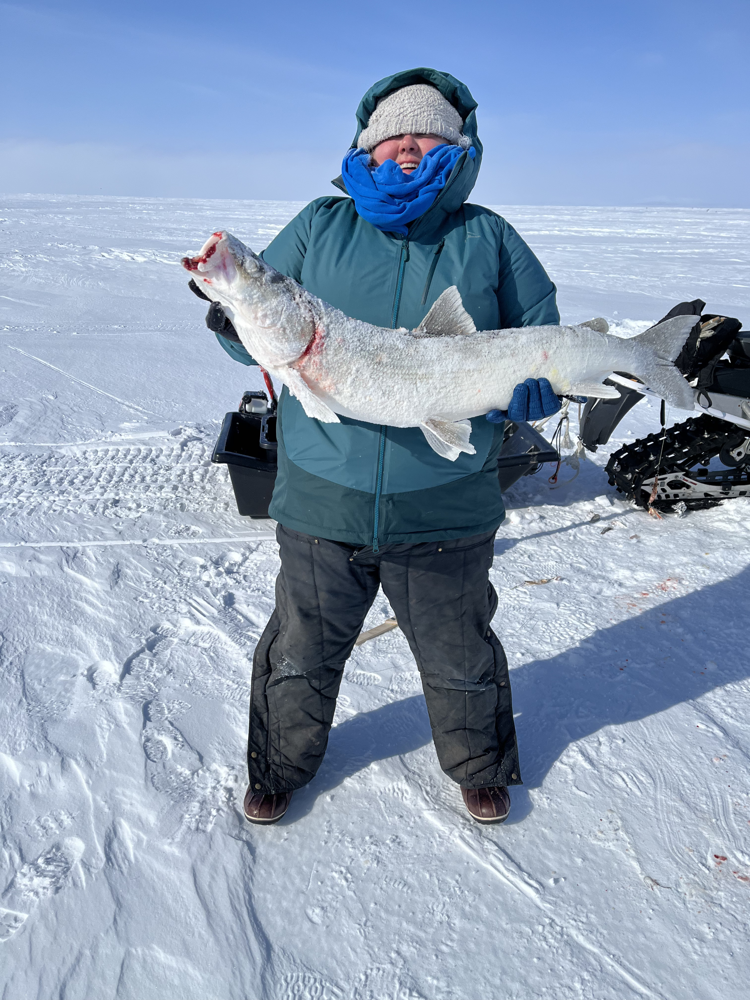

Part of the team was hosted by our community partner, Corina, in Kotzebue in April 2023.

We were able to visit our partners at Aqqaluk Trust, meet face-to-face for the first time altogether, and discuss AT's vision for the NANA region. Lance Kramer (in the second picture below) also explained some of his ideas about curriculum that centers cultural and historical subsistence practices.

Cana also brought us around Kotzebue to gather a better sense of the everyday life and context. For instance, we actually saw the inflated prices of groceries in the store, due to distribution costs.

We witnessed the start to the Kobuk 440 dog sled race. We could hear the dogs in their excitement from a mile away!

And, Corina and Lance were very generous with their time and brought us out on the frozen Kotzebue Sound to ice fish. Andi got the catch of the day! Corina and Lance then taught us some basic proper uses of an Ulu knife, when cleaning a shi fish.

The team also met and hung out with some local high school students and talked about the archiving project with them, as well as attended the Native Youth Games at Kotzebue High School gym. 

Overall, the team members not from Alaska came away with a new appreciation for the stories and experiences that we have heard from Cana, Corina, and others from the NANA region. The infrastructure is simply different and difficult with little-to-no roadway access in between villages, making flying important overall and sno-go snowmobiles in the winter helpful to folks across the region. Internet access is limited to mainly one more popular provider, GCI. We hope to return and learn more about folks' everyday life in the region, so our model of community-led digital archiving integrates more naturally into their existing practices and tools.
