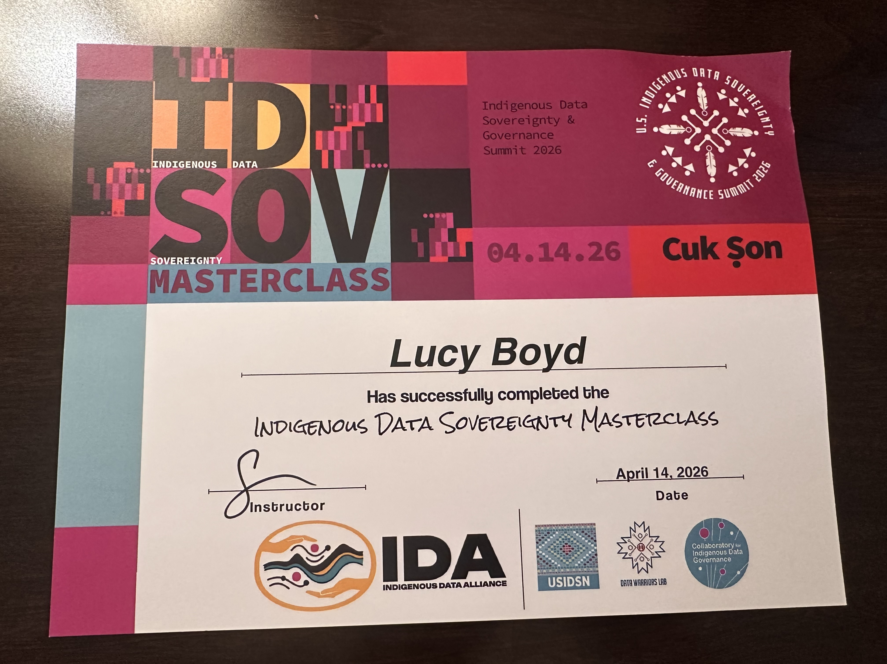

Our team presented our REAL CARE framework that lcoalizes the original CARE principles of Indigenous Data Sovereignty at the 2026 US Indigenous Data Soveriegnty & Governance Summit in Tuscon, Arizona.

Aviññaq and Chris were able to travel to Tuscon, but Chris fell ill on the day of presenting! :-( We are very thankful that Aviññaq represented our work for the entire team at the Summit.

Aviññaq (Lucy) was also able to participate in one of the "Masterclass" workshops on Indigenous Data Sovereignty.
